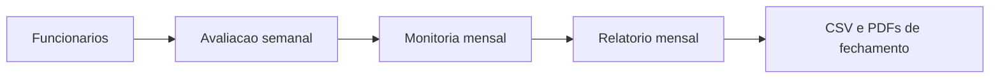

# Guia operacional

Este guia descreve como operar a app **Avaliacao & Bonificacao** no ciclo real de trabalho: cadastrar funcionarios, lancar avaliacoes semanais, avaliar monitoria mensal e gerar o fechamento.

## Objetivo da app

A aplicacao controla a avaliacao de colaboradores da operacao de estoque e expedicao e calcula a bonificacao mensal a partir de:

- avaliacao base semanal dos colaboradores;
- log de erros por semana;
- avaliacao mensal adicional de monitores;
- adicional por tempo de empresa;
- tratamento separado para coordenacao/supervisao.

O fluxo foi desenhado para uso administrativo interno, com revisao visual antes de qualquer gravacao ou exportacao.

## Antes de abrir a app

A app precisa de um banco PostgreSQL/Supabase configurado. Sem `APP_DATABASE_URL` ou chave equivalente, a inicializacao para com erro de configuracao.

No ambiente local, configure a connection string antes de iniciar:

```powershell
python scripts/configure_supabase.py
python -m streamlit run app.py
```

No Streamlit Community Cloud, cadastre a chave `APP_DATABASE_URL` em **App settings > Secrets**. Para preencher automaticamente os dados de picking, cadastre tambem `PICKING_SUPABASE_URL` e `PICKING_SUPABASE_KEY` apontando para o projeto `picking-kaisan`. O arquivo `.streamlit/secrets.toml.example` serve como modelo.

## Primeiro acesso e login

No primeiro acesso, depois que o banco estiver configurado, se ainda nao houver usuario em `login_users`, a app abre a tela **Configurar login**.

1. Informe o usuario administrador.
2. Informe e confirme uma senha com pelo menos 8 caracteres, combinando letras e numeros.
3. A app cria o primeiro administrador e libera o menu.

Depois do primeiro usuario, todos os acessos passam pela tela **Acesso restrito**. A senha e salva com hash PBKDF2, nao em texto puro.

## Navegacao e indicadores laterais

A barra lateral mostra o processo mensal e alguns indicadores da competencia ativa:

- cobertura semanal;
- pendencias criticas;
- quantidade de funcionarios em coordenacao/supervisao;
- status visual de funcionarios, avaliacoes, monitoria e relatorio.

Esses indicadores sao informativos. O fechamento final continua sendo revisado na tela **Relatorio Mensal**, pelo checklist completo.

## Fluxo mensal recomendado

1. **Funcionarios**: cadastre, revise status, marque monitores e coordenacao/supervisao.
2. **Avaliacao Semanal**: lance semanalmente as avaliacoes dos colaboradores.
3. **Monitoria Mensal**: no fechamento, avalie os funcionarios marcados como monitores.
4. **Relatorio Mensal**: revise pendencias, confira totais, baixe CSVs e PDFs.



## Etapa 1: Funcionarios

A tela **Funcionarios** e exclusiva para administradores.

### Cadastro

Campos obrigatorios:

- nome;
- setor;
- funcao;
- data de contratacao.

Campos condicionais:

- **E MONITOR?** exige **Monitor desde**.
- **Coord./Supervisao?** exige **Coord./Sup. desde**.
- um funcionario de coordenacao/supervisao nao pode ser monitor.

Tambem e possivel preencher uma data de desligamento. Se a data for igual ou anterior ao dia atual, o funcionario entra como desativado.

### Listagem e gestao

A aba **Listar & Gerenciar** permite:

- buscar por nome, setor ou funcao;
- filtrar por setor, funcao, monitores e status;
- visualizar tempo de empresa e adicional calculado;
- editar cadastro sem apagar historico;
- desativar ou reativar funcionarios.

Desativar nao apaga avaliacoes antigas. O historico continua disponivel para relatorios de periodos em que o funcionario era valido.

## Etapa 2: Avaliacao Semanal

A tela **Avaliacao Semanal** avalia colaboradores ativos que nao sao coordenacao/supervisao. Para salvar avaliacoes e necessario existir pelo menos um funcionario ativo marcado como coordenacao/supervisao, pois ele sera usado como avaliador.

### Modos disponiveis

- **Avaliar individual**: fluxo detalhado para um funcionario e uma semana.
- **Avaliacao em massa**: edicao em tabela para varios funcionarios.
- **Historico recente**: ultimas 12 avaliacoes salvas.

### Semana e competencia

A data de referencia sempre e convertida para a segunda-feira da semana operacional. A semana operacional vai de segunda a sexta.

A competencia mensal e definida pela sexta-feira da semana:

- sexta-feira ate o dia 25: competencia do proprio mes;
- sexta-feira depois do dia 25: competencia do mes seguinte.

### Criterios semanais

| Criterio | Teto mensal |
| --- | ---: |
| Assiduidade | R$ 150,00 |
| Qualidade | R$ 100,00 |
| Taxa de Erros | R$ 100,00 |
| Produtividade / Eficiencia | R$ 100,00 |
| Comportamento | R$ 100,00 |

O teto mensal de cada criterio e rateado pela quantidade de semanas validas da competencia. A avaliacao semanal mostra a previa financeira usando esse rateio.

### Avaliacao individual

A avaliacao individual tem quatro abas:

1. **Entrada**: define itens/pecas, taxa de erros e percentuais dos demais criterios.
2. **Log de Erros**: registra ocorrencias com tipo, gravidade, quantidade e observacao.
3. **Justificativas**: registra justificativas obrigatorias para todos os criterios.
4. **Previa & Salvar**: mostra o pagamento estimado e grava a avaliacao apos confirmacao.

Quando o Supabase de picking esta configurado, a aba **Entrada** carrega automaticamente:

- `Itens/pecas`: total de pecas retiradas no periodo, somando picking e by-box;
- `Produtividade / Eficiencia`: produtividade do processo executado ou media ponderada quando houve picking e by-box.

A media ponderada da mais peso ao processo com maior volume de pecas:

```text
(produtividade_picking * pecas_picking + produtividade_bybox * pecas_bybox)
/ (pecas_picking + pecas_bybox)
```

Se a consulta externa funcionar e nao houver execucao nos processos de picking, os itens ficam `0` e a produtividade permanece editavel para avaliacao manual. Se a fonte externa falhar, a avaliacao nao assume `0` automaticamente e mostra um aviso de configuracao/consulta.

Atalhos disponiveis:

- copiar ultima avaliacao;
- sugerir notas automaticamente;
- aplicar padrao 100%;
- aplicar picking;
- calcular sugestao para taxa de erros com base no log.

Para salvar, todas as cinco justificativas precisam estar preenchidas e o usuario precisa confirmar a revisao.

### Log de erros

Cada erro semanal registra:

- funcionario;
- semana;
- funcao no momento do registro;
- tipo de erro;
- gravidade;
- quantidade;
- observacao.

Gravidades aceitas:

- `BAIXO`;
- `MEDIO`;
- `ALTO`;
- `CRITICO`.

Para funcoes de expedicao, erro critico do tipo **Pedido enviado errado** pode zerar a taxa de erros da semana quando a opcao **Critico zera taxa** estiver marcada.

### Avaliacao em massa

O modo em massa permite filtrar colaboradores por setor, funcao e monitoria, editar a tabela e salvar apenas os selecionados.

Acoes rapidas:

- marcar todos;
- desmarcar;
- aplicar 100%;
- aplicar 80%;
- aplicar avaliador padrao;
- copiar ultima base;
- recarregar do banco;
- atualizar picking;
- aplicar justificativas padrao aos selecionados.

Antes de salvar, a app valida percentuais, itens, avaliador e justificativas dos selecionados. O banco so e alterado ao clicar em **Salvar selecionados no banco**.

## Etapa 3: Monitoria Mensal

A tela **Monitoria Mensal** avalia somente funcionarios ativos marcados como monitores e que ja sao elegiveis pela data **Monitor desde**.

A primeira semana como monitor nao conta. O monitor so entra na competencia quando existir pelo menos uma semana posterior a semana de inicio.

### Criterios de monitoria

| Criterio | Peso observado | Teto mensal |
| --- | ---: | ---: |
| Acompanhamento de metas | 40% | R$ 120,00 |
| Organizacao do fluxo | 25% | R$ 75,00 |
| Suporte a equipe | 20% | R$ 60,00 |
| Disciplina operacional | 15% | R$ 45,00 |

Total maximo da monitoria: **R$ 300,00**.

### Abas

- **Criterios**: sliders de 0 a 100 para cada criterio.
- **Justificativas**: notas gerais e justificativas obrigatorias por criterio.
- **Previa & Salvar**: calculo da monitoria e confirmacao.
- **Detalhes & KPIs**: score medio, preenchimento de justificativas e total estimado.

## Etapa 4: Relatorio Mensal

A tela **Relatorio Mensal** consolida a competencia selecionada e gera os arquivos finais.

### Resumo

A aba **Resumo** mostra:

- semanas consideradas no fechamento;
- checklist de fechamento;
- filtros por busca, setor e funcao;
- totais do filtro atual;
- tabelas separadas de colaboradores e coordenacao/supervisao;
- ranking por total geral;
- PDF executivo com assinatura;
- anexo RH semanal em percentual, opcional;
- CSV completo da visao filtrada.

O checklist aponta pendencias como:

- avaliacoes semanais faltantes;
- avaliacoes duplicadas;
- datas de semana com sujeira no banco;
- justificativas semanais faltantes;
- datas de contratacao faltantes;
- datas de inicio de monitor ou coordenacao/supervisao faltantes;
- avaliacoes antes da contratacao;
- avaliacoes registradas para coordenacao/supervisao;
- monitoria mensal faltante;
- justificativas de monitoria faltantes.

### Setor unificado

A aba **Setor unificado** prepara uma visao para feedback e acompanhamento por setor.

Ela gera:

- resumo agregado por setor;
- lista de funcionarios com indicador de atencao;
- cobertura de avaliacoes;
- semanas avaliadas/elegiveis;
- foco do feedback;
- frequencia sugerida de acompanhamento;
- feedback sugerido;
- CSV e PDF do setor.

Indicadores como **Regularizar** e **Prioritario** sao usados para chamar atencao para pendencias, baixa cobertura, erros ou medias baixas.

### Detalhado por funcionario

A aba **Detalhado por funcionario** monta uma visao auditavel de um colaborador:

- resumo financeiro do periodo;
- semanas avaliadas/elegiveis;
- quantidade de erros;
- media de produtividade/eficiencia;
- valores por componente;
- percentuais, faixas e pagamento por semana;
- justificativas;
- log de erros;
- monitoria quando aplicavel;
- PDF detalhado individual.

## Regras de elegibilidade

### Contratacao

O funcionario so entra em semanas posteriores a semana da contratacao. Exemplo: se foi contratado em uma terca-feira, a semana que comecou na segunda-feira daquela mesma semana nao entra; a proxima semana pode entrar.

### Desligamento

Semanas com segunda-feira posterior a data de desligamento nao entram. Se o desligamento ocorreu durante a competencia, o funcionario pode aparecer no relatorio com as semanas elegiveis ate a data.

### Monitoria

Um monitor precisa:

- estar marcado como monitor;
- nao ser coordenacao/supervisao;
- ter **Monitor desde** preenchido;
- ter pelo menos uma semana elegivel posterior a semana de inicio como monitor.

### Coordenacao/supervisao

Um funcionario de coordenacao/supervisao precisa ter **Coord./Sup. desde** preenchido. Quando elegivel na competencia, ele aparece em grupo separado no relatorio e nao deve receber avaliacao semanal.

## Calculo da bonificacao

Cada criterio usa faixas de pagamento:

| Resultado | Percentual pago do criterio |
| ---: | ---: |
| 0% a 50% | 0% |
| >50% a 70% | 25% |
| >70% a 80% | 50% |
| >80% a 90% | 75% |
| >90% a 100% | 100% |

Formula resumida:

```text
Total geral = avaliacao base + monitoria mensal + adicional por tempo de empresa
```

O adicional por tempo de empresa e de **R$ 30,00 por ano completo**, calculado pela data de contratacao em relacao a data de referencia do fechamento.

## Exportacoes

A app gera:

- PDF executivo mensal em paisagem;
- anexo RH semanal com resultados percentuais;
- CSV completo da tela de resumo;
- CSV de setor unificado;
- PDF de setor unificado;
- PDF detalhado por funcionario.

Os PDFs usam `assets/logo.png` quando o arquivo esta disponivel.

## Cuidados antes do fechamento

Antes de enviar os arquivos finais:

1. Abra o checklist de fechamento.
2. Resolva avaliacoes e justificativas faltantes.
3. Confira se monitores e coordenacao/supervisao tem datas de inicio.
4. Confira se o filtro do relatorio esta correto.
5. Gere o PDF executivo e, se necessario, o anexo RH.
6. Baixe o CSV completo para conferencia ou arquivo interno.
