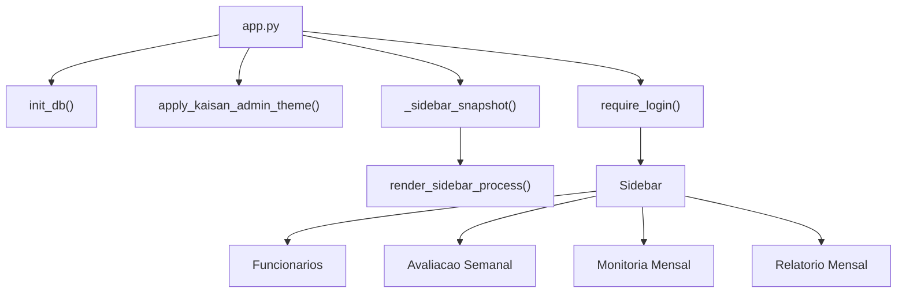

# Referencia tecnica

Esta referencia documenta a estrutura interna da app **Avaliacao & Bonificacao** para manutencao, auditoria e evolucao.

## Stack

- **Python 3.13**
- **Streamlit 1.50.0**
- **PostgreSQL/Supabase**
- **Pandas 2.2.3**
- **ReportLab 4.4.4**
- CSS customizado em `theme.py`

Dependencias declaradas em `requirements.txt`:

```text
streamlit==1.50.0
pandas==2.2.3
reportlab==4.4.4
psycopg[binary]>=3.2.0
```

## Como executar

```powershell
python -m pip install -r requirements.txt
# configure APP_DATABASE_URL antes de iniciar
python -m streamlit run app.py
```

A aplicacao exige `APP_DATABASE_URL` ou equivalente apontando para o Supabase/PostgreSQL. `init_db()` valida a conexao e garante o schema remoto.

Chaves aceitas:

- `APP_DATABASE_URL`;
- `DATABASE_URL`;
- `SUPABASE_DB_URL`;
- `st.secrets["database"]["url"]`;
- `st.secrets["connections"]["supabase"]["url"]`;
- `st.secrets["connections"]["postgres"]["url"]`.

Use `.streamlit/secrets.toml.example` como modelo para desenvolvimento local.

## Ponto de entrada

`app.py` configura a pagina Streamlit, inicializa banco e tema, exige login e monta a navegacao lateral com snapshot da competencia ativa.



Menu:

- `1. Funcionarios`: apenas administradores;
- `2. Avaliacao Semanal`;
- `3. Monitoria Mensal`;
- `4. Relatorio Mensal`.

## Mapa de modulos

| Arquivo | Responsabilidade |
| --- | --- |
| `app.py` | Entrypoint, page config, login obrigatorio, snapshot da competencia e roteamento do menu. |
| `constants.py` | Criterios, tetos de pagamento, faixas, gravidades e tipos padrao de erro. |
| `db.py` | Conexao PostgreSQL/Supabase, compatibilidade SQLite para testes, schema, migracoes leves, autenticacao, CRUD de funcionarios e upserts de avaliacoes. |
| `rules.py` | Regras de familia de cargo, sugestao de taxa de erros e calculo de pagamento semanal. |
| `utils.py` | Formatacao BR, datas, competencia, semanas operacionais e rateios mensais. |
| `theme.py` | CSS global, cabecalhos, cards, chips, paineis de progresso, stepper lateral e avisos. |
| `ui_auth.py` | Primeiro administrador, login, sessao e permissao de admin. |
| `ui_employees.py` | Cadastro, listagem, edicao, ativacao/desativacao de funcionarios. |
| `ui_weekly.py` | Avaliacao semanal individual, avaliacao em massa, log de erros, justificativas e historico. |
| `ui_monitor.py` | Avaliacao mensal de monitores, justificativas e previa financeira. |
| `ui_report.py` | Fechamento mensal, checklist, consolidacoes, CSVs e PDFs. |

## Banco de dados

O banco oficial e o projeto Supabase configurado via:

```text
APP_DATABASE_URL
```

Arquivos SQLite locais, como `avaliacoes.db`, sao ignorados pelo repositorio e servem apenas como artefatos temporarios de migracao/testes. Em execucao normal, o app nao usa SQLite como fallback.

`db.get_database_url()` busca a connection string nas variaveis de ambiente e depois em `st.secrets`. `db.require_postgres_database_url()` bloqueia a inicializacao se a URL estiver ausente ou nao for PostgreSQL.

### Adaptador de conexao

`CompatConnection` permite que o restante do codigo continue usando placeholders `?`. Em PostgreSQL, `_prepare_query()` troca `?` por `%s` antes de executar via `psycopg`.

Funcoes auxiliares de SQL mantem consultas compativeis entre PostgreSQL e SQLite de testes:

- `sql_clean_text_expr()`;
- `sql_group_concat()`;
- `sql_quote()`.

### SQLite somente em testes

SQLite e usado apenas quando:

```text
AVALIACAO_ALLOW_SQLITE=1
```

`tests/conftest.py` define essa variavel para a suite. Fora desse modo, `init_db()` exige PostgreSQL/Supabase.

### Migracoes Supabase

O schema SQL versionado fica em:

```text
supabase/migrations/20260522203641_init_avaliacoes_schema.sql
```

Tambem existe `supabase/config.toml` para uso com Supabase CLI local.

Para migrar dados antigos do SQLite:

```powershell
python scripts/migrate_sqlite_to_supabase.py --sqlite-path ".\avaliacoes.db" --database-url "postgresql://..."
```

Com `--replace`, o script apaga os dados das tabelas de destino antes de importar. Use somente com backup confirmado.

### Tabelas

#### `login_users`

Armazena usuarios de acesso.

Campos principais:

- `id`;
- `username`;
- `password_hash`;
- `role`;
- `active`;
- `last_login_at`;
- `created_at`;
- `updated_at`.

No PostgreSQL, `username` e protegido por indice unico em `LOWER(username)`. No SQLite de testes, a coluna usa unicidade case-insensitive. Senhas usam PBKDF2 SHA-256 com salt e `390_000` iteracoes.

#### `employees`

Cadastro de funcionarios.

Campos principais:

- `id`;
- `name`;
- `sector`;
- `role`;
- `hire_date`;
- `monitor_start_date`;
- `leadership_start_date`;
- `termination_date`;
- `is_monitor`;
- `is_leadership`;
- `active`;
- `deactivated_at`;
- `created_at`;
- `created_by_user_id`;
- `created_by_username`;
- `updated_by_user_id`;
- `updated_by_username`;
- `updated_at`.

Regras aplicadas no cadastro/edicao:

- data de contratacao e obrigatoria;
- monitor exige data de inicio como monitor;
- coordenacao/supervisao exige data propria de inicio;
- coordenacao/supervisao nao pode ser monitor;
- data de desligamento passada ou atual desativa o funcionario.

#### `weekly_evaluations`

Avaliacoes semanais por funcionario.

Chave unica:

```text
employee_id + week_start
```

Campos principais:

- `employee_id`;
- `week_start`;
- `evaluator`;
- `notes`;
- percentuais dos criterios semanais;
- `efficiency_pct`;
- `items_count`;
- justificativas por criterio;
- `created_at`.

O salvamento usa upsert. Ao salvar de novo a mesma semana do mesmo funcionario, os campos sao atualizados.

#### `weekly_errors`

Log detalhado de erros semanais.

Campos principais:

- `employee_id`;
- `week_start`;
- `role_snapshot`;
- `error_type`;
- `severity`;
- `qty`;
- `notes`;
- `created_at`.

E usado pela sugestao de taxa de erros e pelos relatorios detalhados.

#### `monitor_monthly_evaluations`

Avaliacoes mensais de monitores.

Chave unica:

```text
employee_id + month
```

Campos principais:

- `employee_id`;
- `month`;
- `evaluator`;
- `notes`;
- percentuais dos criterios de monitoria;
- justificativas por criterio;
- `created_at`.

O salvamento tambem usa upsert.

### Indices

`init_db()` cria indices para consultas comuns:

- `idx_login_users_active`;
- `idx_employees_active_role`;
- `idx_weekly_eval_employee_week`;
- `idx_weekly_eval_employee_week_desc`;
- `idx_weekly_errors_employee_week`;
- `idx_monitor_eval_employee_month`.

### RLS e acesso direto

No PostgreSQL, `init_postgres_db()` habilita Row Level Security nas tabelas principais e revoga acesso de `anon` e `authenticated`. A app acessa o banco pela connection string PostgreSQL configurada no ambiente/Secrets.

## Regras de negocio

### Criterios semanais

Definidos em `constants.WEEKLY_CRITERIA`:

| Key | Label | Valor semanal legado | Teto mensal |
| --- | --- | ---: | ---: |
| `assiduidade` | Assiduidade | R$ 37,50 | R$ 150,00 |
| `qualidade` | Qualidade | R$ 25,00 | R$ 100,00 |
| `taxa_erros` | Taxa de Erros | R$ 25,00 | R$ 100,00 |
| `produtividade` | Produtividade | R$ 25,00 | R$ 100,00 |
| `comportamento` | Comportamento | R$ 25,00 | R$ 100,00 |

O valor efetivo da semana e calculado por:

```text
valor_da_semana = teto_mensal / quantidade_de_semanas_da_competencia
```

### Criterios de monitoria

Definidos em `constants.MONITOR_MONTHLY_CRITERIA`:

| Key | Label | Teto mensal | Peso observado |
| --- | --- | ---: | --- |
| `acomp_metas` | Acompanhamento de metas | R$ 120,00 | 40% |
| `org_fluxo` | Organizacao do fluxo | R$ 75,00 | 25% |
| `suporte_equipe` | Suporte a equipe | R$ 60,00 | 20% |
| `disciplina_oper` | Disciplina operacional | R$ 45,00 | 15% |

Total mensal maximo: R$ 300,00.

### Faixas de pagamento

Definidas em `constants.PAY_BANDS` e interpretadas por `utils.pay_band_multiplier()`.

| Resultado | Multiplicador |
| ---: | ---: |
| 0% a 50% | 0.00 |
| >50% a 70% | 0.25 |
| >70% a 80% | 0.50 |
| >80% a 90% | 0.75 |
| >90% a 100% | 1.00 |

Os limites sao tratados de forma continua para evitar lacunas com decimais. Por exemplo, `90.5%` entra na faixa acima de 90%.

### Competencia e fechamento

`utils.FECHAMENTO_DIA = 25`.

`competencia_from_week_start()` usa a sexta-feira da semana operacional:

- sexta ate dia 25: competencia da propria sexta;
- sexta apos dia 25: proxima competencia.

`weeks_for_competencia()` busca todas as segundas-feiras cuja sexta-feira pertence a competencia calculada.

### Elegibilidade por datas

`eligible_weeks_for_valid_employee()` aplica:

- funcionario precisa ter `hire_date` valida;
- so entram semanas posteriores a semana da contratacao;
- se houver `termination_date`, so entram semanas com segunda-feira menor ou igual a data de desligamento.

Monitoria e coordenacao/supervisao usam a mesma regra de "segunda semana em diante", mas exigem datas especificas:

- `monitor_start_date`;
- `leadership_start_date`.

### Coordenacao/supervisao

Quando elegivel para a competencia, coordenacao/supervisao:

- aparece em grupo separado no relatorio;
- nao deve ter avaliacao semanal;
- recebe como base mensal padrao a soma dos tetos semanais, atualmente R$ 550,00.

O checklist de fechamento acusa avaliacoes semanais registradas para esse grupo.

### Adicional por tempo de empresa

`TENURE_BONUS_PER_YEAR = 30.00`.

`tenure_bonus()` calcula anos completos entre a data de contratacao e a data de referencia do fechamento, multiplicando por R$ 30,00.

### Sugestao de taxa de erros

`rules.suggest_taxa_erros_pct()`:

- classifica cargo em familia: `EXPEDICAO`, `PICKING`, `ESTOQUE` ou `GERAL`;
- soma erros ponderados por gravidade;
- para expedicao, erro critico do tipo **Pedido enviado errado** pode sugerir `0%`;
- para picking, usa erros ponderados sobre `items_count` com fator ajustavel;
- para outras familias, aplica penalidade simples sobre o peso dos erros.

Pesos por gravidade:

| Gravidade | Peso |
| --- | ---: |
| `BAIXO` | 0.5 |
| `MEDIO` | 1.0 |
| `ALTO` | 2.0 |
| `CRITICO` | 4.0 |

## Relatorios e exportacoes

`ui_report.py` concentra os builders de dados e PDFs.

Funcoes principais:

- `build_month_df()`: consolidado financeiro mensal;
- `build_closing_check_tables()`: checklist de pendencias do fechamento;
- `build_sector_followup_tables()`: acompanhamento por setor;
- `build_employee_period_summary()`: resumo individual;
- `build_report_pdf_bytes_executivo()`: PDF executivo mensal;
- `build_sector_followup_pdf_bytes()`: PDF de setor;
- `build_detailed_employee_pdf_bytes()`: PDF individual;
- `build_weekly_pct_tables_for_pdf()`: anexo RH semanal.

Os PDFs usam ReportLab e recebem bytes diretamente para `st.download_button()`.

## Tema e UX

`theme.py` injeta CSS global com `st.markdown(..., unsafe_allow_html=True)`. Ele tambem fornece componentes auxiliares:

- `render_page_header()`;
- `render_section_header()`;
- `render_divider()`;
- `render_status_notice()`;
- `render_status_cards()`;
- `render_status_chip()`;
- `render_stage_grid()`;
- `render_focus_strip()`;
- `render_progress_panel()`;
- `render_sidebar_process()`;
- `mark_operation_status()`;
- `render_operation_status()`.

Uso atual dos componentes novos:

- `app.py`: stepper lateral com competencia, cobertura, pendencias e coordenacao/supervisao.
- `ui_weekly.py`: progresso do lote, estagios e alerta de pendencias na avaliacao em massa.
- `ui_monitor.py`: progresso de justificativas e estagios da monitoria mensal.
- `ui_report.py`: progresso do fechamento, estagios de liberacao e foco operacional.
- `ui_employees.py`: alerta visual para manutencao de cadastro/status.

O guia visual completo esta em `docs/STYLE_GUIDE.md`.

## Testes

A suite cobre regras sensiveis do dominio e pontos de regressao.

Arquivos atuais:

- `tests/test_login_auth.py`: hash de senha, login valido/invalido e usuario duplicado.
- `tests/test_employee_validation.py`: validacoes de cadastro, datas, monitoria, coordenacao e auditoria de usuario.
- `tests/test_pay_bands.py`: bordas decimais das faixas de pagamento.
- `tests/test_role_start_dates.py`: regra de segunda semana para datas de inicio.
- `tests/test_report_period_validity.py`: funcionarios validos no periodo.
- `tests/test_sector_followup_report.py`: acompanhamento de setor e PDF.
- `tests/test_mass_editor_sync.py`: sincronizacao do editor em massa.
- `tests/test_theme_cards.py`: HTML compacto dos cards de status.

Para rodar:

```powershell
python -m pytest
```

Observacao: `pytest` nao esta listado em `requirements.txt`; instale no ambiente de desenvolvimento se necessario. A suite ativa `AVALIACAO_ALLOW_SQLITE=1` em `tests/conftest.py`, portanto nao exige Supabase para os testes unitarios atuais.

## Deploy

O README raiz documenta o deploy no Streamlit Community Cloud.

Configuracao esperada:

- repositorio: `yohann-risso/avaliacao`;
- branch: `main`;
- arquivo principal: `app.py`;
- dependencias: `requirements.txt`;
- tema: `.streamlit/config.toml`;
- Python 3.13.

### Persistencia remota obrigatoria

Sem `APP_DATABASE_URL`, `DATABASE_URL` ou `SUPABASE_DB_URL`, a aplicacao para na inicializacao com erro de configuracao. Essa protecao evita gravacao acidental em arquivo local no Streamlit Cloud.

Veja tambem [Supabase e PostgreSQL](SUPABASE.md).

## Checklist de manutencao

Ao alterar regras de pagamento:

1. Atualize `constants.py` ou `rules.py`.
2. Revise `ui_weekly.py`, `ui_monitor.py` e `ui_report.py`.
3. Adicione ou ajuste testes de borda.
4. Atualize esta documentacao e o guia resumido se a regra for visivel ao usuario.

Ao alterar schema:

1. Atualize `init_postgres_db()` e a migration em `supabase/migrations/`.
2. Se a mudanca precisar afetar testes SQLite, atualize tambem o trecho SQLite em `init_db()`.
3. Garanta compatibilidade com bancos antigos via `ALTER TABLE ... ADD COLUMN IF NOT EXISTS` quando aplicavel.
4. Atualize funcoes de leitura/escrita em `db.py`.
5. Atualize relatorios, script de migracao e testes.

Ao alterar fluxo de tela:

1. Preserve confirmacoes antes de gravar.
2. Mantenha justificativas obrigatorias quando houver desconto ou fechamento.
3. Atualize o guia operacional.
4. Execute os testes.
